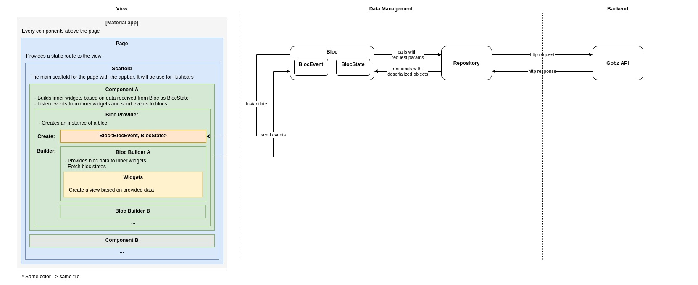
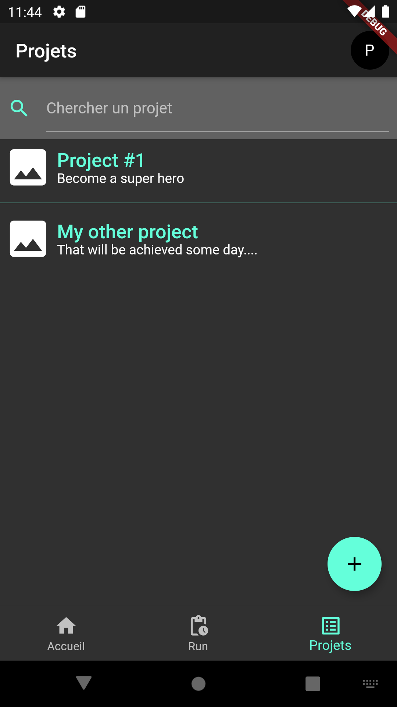

# Gobz App
A project management mobile app

## Install
### Backend
This project requires a connection to the [gobz-back](https://github.com/Poulpinou/gobz-back) API in order to work correctly.

### Classes generation
Some classes have to be generated with this command :
```
flutter pub run build_runner build --delete-conflicting-outputs
```
or if you want them to be generated while editing code:
```
flutter pub run build_runner watch --delete-conflicting-outputs
```
or you can add [this script](/scripts/build_watch.sh) to your run configurations if you are usin IntelliJ.

### Run the app
To run this app, run one of those files *lib/main_{env}_{target}.dart* (if none of those files is matching your config, you can create your own).


## Structure

```
.
│ pubspec.yaml
│ pubspec.lock
├── lib
│   ├── data                           => Contains data related objects
│   │   ├── blocs                      => A bloc provides a way for views to interract with repositories
│   │   ├── clients                    => Api clients
│   │   ├── configurations             => Application configurations
│   │   ├── exceptions                 => Custom exceptions
│   │   ├── formInputs                 => Formz input validators
│   │   ├── mixins
│   │   ├── models
│   │   │   ├── enums
│   │   │   ├── requests               => Request dtos
│   │   │   ├── {model}.dart
│   │   │   └── {model}.g.dart         => Generated models parts
│   │   ├── repositories               => A repository provides methods to exchange with APIs
│   │   ├── themes
│   │   └── utils
│   ├── view                           => Contains widgets used to build views
│   │   ├── components                 => Components are widgets that links blocs and display widgets
│   │   │   ├── forms
│   │   │   └── {component}.dart
│   │   ├── pages
│   │   ├── widgets                    => Those widgets are used for display, not for data interaction 
│   │   │   ├── generic                => Reusable widgets
│   │   │   └── {widgetCategory}
│   │   └── GobzApp.dart
│   └── main_{env}_{device}.dart       => Start files
├── scripts                            => Some useful scripts
├── tests                              => TODO
├── android
└── ios
```



## Screenshots
| Create your projects | Keep track of evolution | Create detailed tasks |
|---|---|---|
|  |  |  |